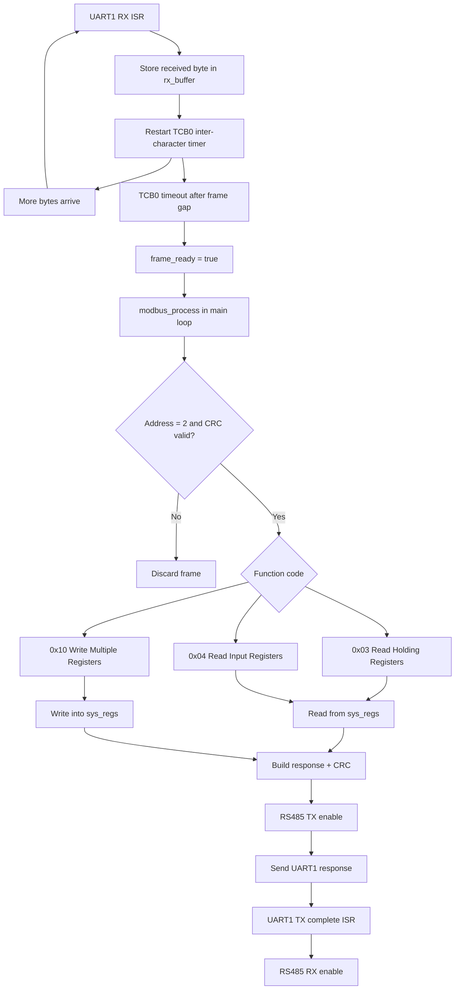
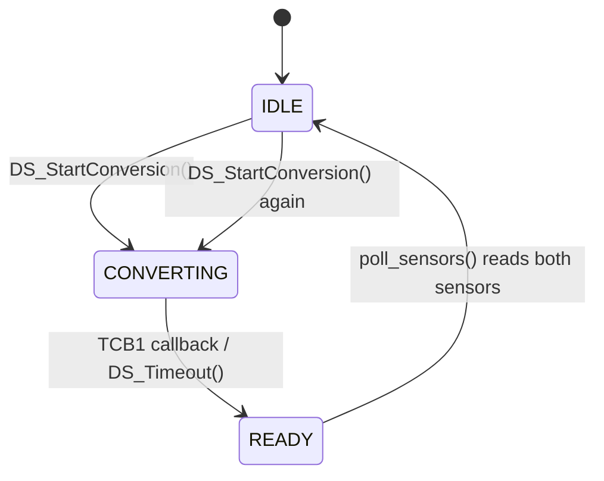
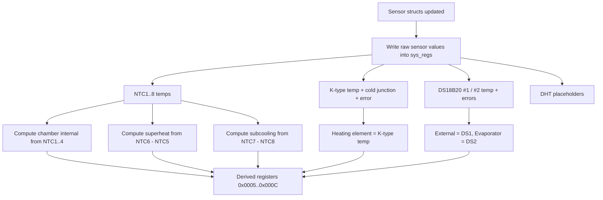

# Firmware Flow Diagram

Target: `AVR128DB32` sensor board acting as a `Modbus RTU slave` for:

- `8x NTC` channels
- `2x DS18B20`
- `1x K-type thermocouple`

The firmware behavior below is taken from the current code in `main.c`, `functions/modbus.c`, `functions/temp_sensors.c`, and `DS.c`.

## Top-Level Firmware Flow

```mermaid
flowchart TD
    A[Power-up / Reset] --> B[SYSTEM_Initialize]
    B --> C[RTC PIT callback = PIT 1 Hz]
    C --> D[_SYS_INIT]
    D --> D1[Clear sys_regs]
    D1 --> D2[Set firmware/status/sensor-enable registers]
    D2 --> D3[MB_Init]
    D3 --> D4[KTYPE_Init]
    D4 --> D5[DS_Init and start first DS conversion]
    D5 --> E[RS485_RX_ENABLE]
    E --> F[RUN_LED_SET + sei]
    F --> G{while(1)}
    G --> H[modbus_process]
    H --> I[poll_sensors]
    I --> G
```

## Main Loop Detail

```mermaid
flowchart TD
    A[while(1)] --> B[modbus_process]
    B --> C{STATUS_POLL_ACTIVE?}
    C -- No --> A
    C -- Yes --> D[MEASURE_LED on]
    D --> E[Read enabled NTC1..NTC8]
    E --> F{KTYPE state = READ_READY?}
    F -- Yes --> G[Read thermocouple + cold junction]
    F -- No --> H
    G --> H{DS system state = READY?}
    H -- Yes --> I[Read DS18B20 #1 if enabled]
    I --> J[Read DS18B20 #2 if enabled]
    J --> K[Set DS state to IDLE]
    K --> L[Start next DS conversion]
    H -- No --> M
    L --> M[Update sys_regs from sensor structs]
    G --> M
    E --> M
    M --> N[Compute derived temperatures]
    N --> O[MEASURE_LED off]
    O --> A
```

## Sensor Acquisition Flow

```mermaid
flowchart LR
    subgraph NTC[NTC path]
        N1[Select mux channel A/B/C] --> N2[Enable MCP3201 path]
        N2 --> N3[Bit-bang 16 clocks on PA6]
        N3 --> N4[Read 12-bit ADC on PA5]
        N4 --> N5[Average 20 samples]
        N5 --> N6[Convert ADC to resistance]
        N6 --> N7[Beta equation to degC]
        N7 --> N8[Store temp in ntc_temp[] and NTC struct]
    end

    subgraph KTYPE[K-type path]
        K1[TCB2 marks KTYPE_READ_READY] --> K2[Disable NTC path]
        K2 --> K3[Assert thermocouple CS on PD1]
        K3 --> K4[Bit-bang 32 clocks]
        K4 --> K5[Decode MAX31855-style frame]
        K5 --> K6[Extract thermocouple temp]
        K5 --> K7[Extract cold-junction temp]
        K5 --> K8[Check open / short faults]
    end

    subgraph DS[DS18B20 path]
        D1[DS_Init] --> D2[Start conversion on enabled sensors]
        D2 --> D3[TCB1 timeout]
        D3 --> D4[DS_SYSTEM_READY]
        D4 --> D5[Read scratchpad sensor 1]
        D4 --> D6[Read scratchpad sensor 2]
        D5 --> D7[CRC check]
        D6 --> D8[CRC check]
        D7 --> D9[Store temp and error]
        D8 --> D9
        D9 --> D10[Immediately start next conversion]
    end
```

## Modbus / RS485 Flow



## DS18B20 State Machine



## Register Update Flow



## Interrupt / Timer Roles

- `RTC PIT`: 1 Hz heartbeat, toggles run LED, increments uptime registers.
- `TCB0`: Modbus RTU frame-gap timer for UART1 receive buffering.
- `TCB1`: DS18B20 conversion-complete timer.
- `TCB2`: thermocouple ready-delay timer.

## Notes From Current Code

- `DHT11` code exists but polling is commented out, so it is not active in the current firmware.
- `poll_sensors()` runs continuously with no deliberate delay in the main loop.
- `NTC` readings are synchronous and dominate loop work because each enabled channel is sampled and averaged every pass.
- `DS18B20` handling is asynchronous: conversion runs in the background, then both sensors are read together when ready.
- The register map comments say many temperatures are `degC x10`, but current code stores:
  - `NTC` and derived values mostly as `degC x10`
  - `DS18B20` as `degC x100`
  - `K-type` raw thermocouple and cold-junction values as `degC x100`

